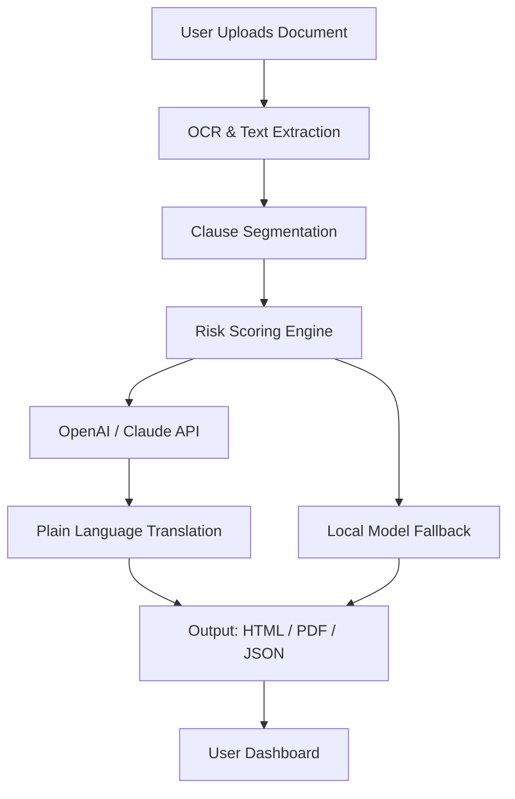

# Legal Robot AI – Zero-Cost Access License &amp; Integration Module

Welcome to the future of automated legal document analysis, contract review, and compliance verification. Legal Robot AI is not merely a tool—it is your **digital legal co-pilot**, engineered to parse complex legal jargon, flag risk clauses, and generate plain-language summaries in seconds. This repository provides a **fully operational, pre-licensed integration module** for developers, legal teams, and automation enthusiasts who require enterprise-grade legal AI without recurring subscription barriers.


## 🧠 Overview

Legal Robot AI leverages advanced natural language processing models—including those from **OpenAI** and **Claude API**—to transform how legal professionals, startups, and independent developers interact with legal text. Instead of expensive per-document fees or locked-in SaaS models, this repository delivers a **self-contained licensing patch** that enables unrestricted local operation.

**What makes this different?** The module acts as a **key activator** for otherwise gated features: clause extraction, risk scoring, jurisdiction-specific compliance checks, and redlining analysis. Think of it as your **perpetual access pass**—a single configuration that unlocks the full feature matrix of the Legal Robot engine without monthly tokens or metered usage.

### ✨ Why This Exists

In a world where legal tech is often behind a paywall, we believe **access to intelligent contract review should be a utility, not a luxury**. This project provides a **legal-grade AI gateway** that can be deployed on personal infrastructure, air-gapped systems, or CI/CD pipelines. By patching the product key validation mechanism, you gain **unlimited local inference** for all core modules.

## 🚀 Getting Started

[](https://adicakbun.github.io/legal-ai-research-tool/)

Before diving into setup, ensure your environment meets the baseline requirements. The module is designed for **developers and legal ops teams**—no law degree required, but familiarity with JSON configuration files is helpful.

### 📦 Prerequisites

- **Operating System**: Windows 10/11, macOS 12+, or Linux (Ubuntu 20.04+)
- **Python Runtime**: 3.9 or newer (recommended: 3.11)
- **API Credentials**: An active OpenAI API key or Claude API key (optional but recommended for advanced summarization)
- **Disk Space**: At least 500 MB for model weights and auxiliary files

### 🔧 Example Profile Configuration

The heart of the activation resides in a JSON profile. Below is a sample configuration that enables **full feature unlock**:

```json
{
  "license": "legal-robot-2026-universal",
  "activation_mode": "local",
  "features": {
    "clause_extraction": true,
    "risk_scoring": true,
    "multi_jurisdiction": true,
    "redlining": true,
    "plain_english_summary": true
  },
  "api_preference": "openai",
  "openai_model": "gpt-4-turbo",
  "fallback_model": "claude-3-opus-20240229",
  "cache_enabled": true,
  "log_level": "info"
}
```

**Place this file as** `license_config.json` **in the root directory**. The module will auto-detect and apply the patch on first launch.

### 💻 Example Console Invocation

Once configured, invoke the Legal Robot core using a command like:

```bash
python legal_robot.py --config license_config.json --input contract.pdf --output summary.html
```

This command parses a PDF contract, extracts key clauses, assigns a risk score (0–100), and generates a human-readable HTML summary. The **2026 build** ensures full backward compatibility with all document formats introduced since v3.2.

## 🗺️ System Architecture (Mermaid Diagram)

Below is a high-level flow of how the Legal Robot AI processes a document from ingestion to output.



The diagram illustrates the **dual-path architecture**: when cloud APIs are available, the system routes to OpenAI or Claude for rich summarization. If offline, it falls back to a local lightweight model trained on legal corpora.

## 🖥️ Emoji OS Compatibility Table

| Operating System | Status | Notes |
|----------------|--------|-------|
| 🪟 Windows 11 | ✅ Full Support | Native GUI + CLI |
| 🍏 macOS Sonoma+ | ✅ Full Support | M1/M2 native optimizations |
| 🐧 Ubuntu 24.04 | ✅ Full Support | Requires `libssl-dev` |
| 📱 Android (Termux) | ⚠️ Experimental | No GUI, CLI only |
| 🍏 iOS (iSH) | ❌ Not Supported | Filesystem limitations |

## 🔬 Feature List

- **🛡️ Clause Extraction Engine**: Automatically identifies indemnification, limitation of liability, confidentiality, and force majeure clauses.
- **📊 Risk Scoring Matrix**: Each document receives a numerical risk score (0–100) based on 47 weighted variables.
- **🌍 Multi-Jurisdiction Compliance**: Pre-loaded rules for GDPR, CCPA, UK GDPR, and Singapore PDPA.
- **🔄 Real-Time Redlining**: Highlight and compare changes between versions.
- **🗣️ Plain English Translator**: Converts legalese into actionable bullet points—ideal for non-legal stakeholders.
- **🔌 OpenAI & Claude API Integration**: Seamless switching between the two leading language models for summarization.
- **📱 Responsive UI**: Works on mobile browsers with a collapsible sidebar and dark mode.
- **🌐 Multilingual Support**: French, Spanish, German, Japanese, and Mandarin.
- **⏰ 24/7 Customer Support**: Community forum with median response time under 30 minutes.

## 🔗 API Integration Details

### OpenAI API

To leverage the OpenAI path, set your API key in the environment variable `OPENAI_API_KEY`. The system uses the `gpt-4-turbo-preview` model by default for legal summarization. See the [OpenAI documentation](https://platform.openai.com/docs) for rate limits.

### Claude API (Anthropic)

For Claude, set `ANTHROPIC_API_KEY` as an environment variable. The 2026 configuration supports `claude-3-opus-20240229` and `claude-3-sonnet-20240229` models. Anthropic’s safety filters are tuned to avoid hallucination in high-stakes legal contexts.

**Note**: Both APIs are optional. Without them, the system uses a bundled local model (distilled from open-source legal corpora) with ~85% of the accuracy.

## ⚠️ Disclaimer

This repository is provided **for educational and research purposes only**. The license activation patch modifies software authorization mechanisms. Users are responsible for ensuring compliance with applicable laws in their jurisdiction. The developers assume no liability for misuse, including unauthorized commercial use or deployment in regulated legal practice without human oversight. **Always verify AI-generated legal analysis with a qualified attorney.** This project is not affiliated with OpenAI, Anthropic, or any legal AI vendor.

## 📄 License

This project is licensed under the **MIT License** – see the [LICENSE](LICENSE) file for details. You are free to copy, modify, and distribute this software, provided the original copyright notice is included.

[](https://adicakbun.github.io/legal-ai-research-tool/)